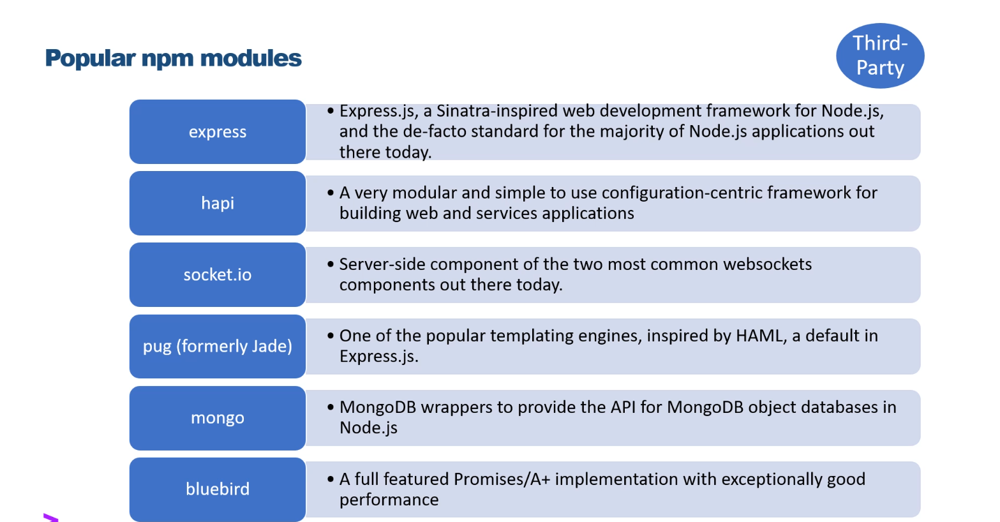
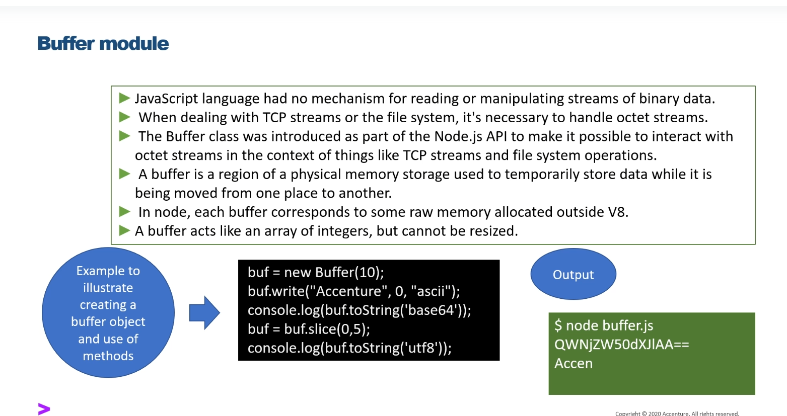
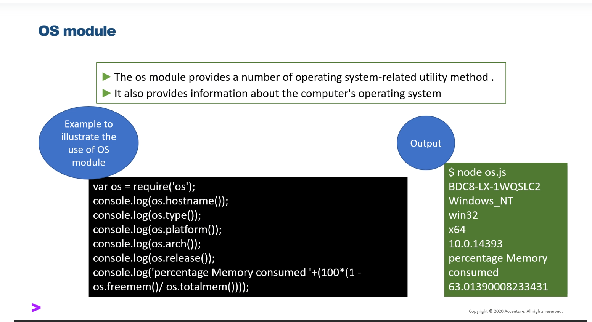
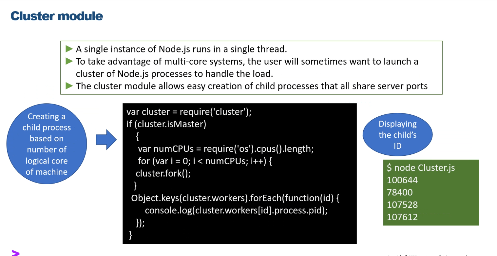
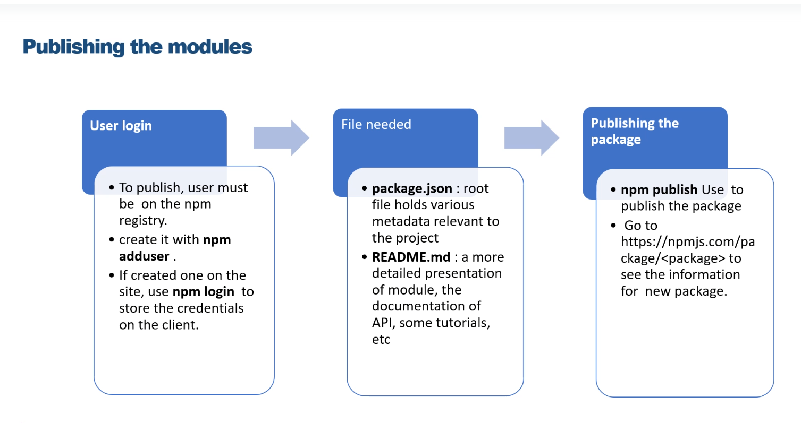
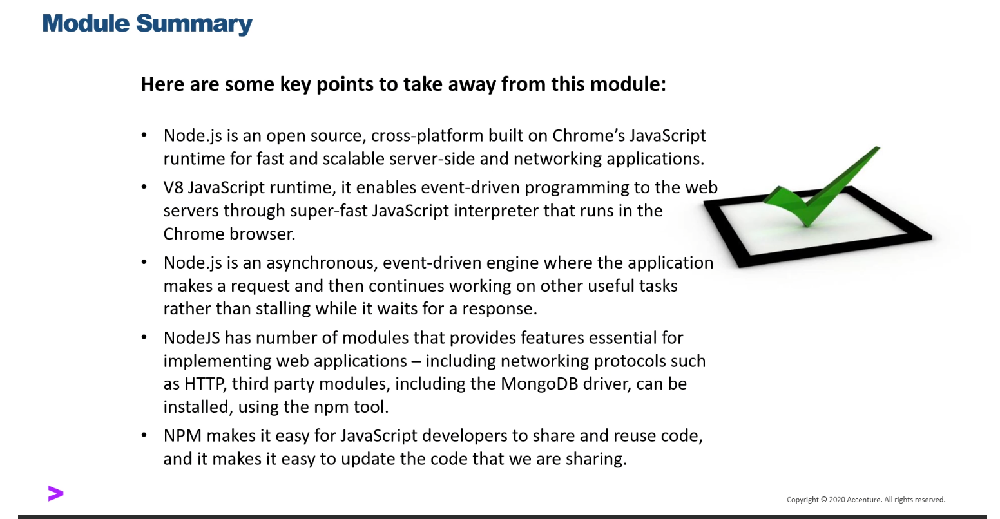

Module Types 
<hr />

Packages are collection of Various Models.
Packages that are stored in NPM are called third party packages.
These Type of modules are developed by others and we can use that in our project.
Third Party modules can be install inside of the project folder 

```sh
npm install <package_name>
```

Exmaple: To Uninstall one of the popular packages gulp 

```sh
npm install gulp 
```

Creates folder node_modules where all packages are installed
Include bare minimum functionalities of Node.js 
the core of the modules are defines in Node's lib folder
Node has several modules compiled into the binary and load automatically when nodejs process starts
core modules are loaded by passing name to require()
example  - file system - require('fs')

<hr/>
Modules created Locally in Nodejs Application 
Include Different Functionalities of application in seperate files and folders
it can also be packaged and distribute it via NPM so that Node.js community can use it 

There are Theree Modules

```sh
1. Core Modules
2. Local Modules
3. Third Party Modules
```
Core Modulees
< hr/>
```sh

http  => http module includes classes methods and events to create Nodejs http server
url   => url modules includes methods for URL resolution and parsing
querystring  => querystring module includes methods to deal with query string
path  => path module includes methods to deal with file paths
fs   => fs module includes classes, methods  and events to work with file I/O
util => util module includes utility functions useful for programmers
buffer => The Bufferd modules provides a way of handling Strams of Binary Data
OS => the os module provides a number of operating system- related utility methods
cluster => the cluster Module  provides a way of creating child processes that runs simulteneously and share the same server port 
```


Local Modules 
<hr/>


Export Functionalities in one File 

```sh 
exports.myText = 'This text was exported from myModule.';
```

Import other files functionality 

```sh
var myModule = require('./my-module.js');
console.log('text from Module':  myModule.myText);
```


Third Party Modules 
<hr />




File System Module 
<hr />
1. Node.js includes fs module to access physical file System. the fs module is responsible for all the asynchronous or synchronous file I/O Operations 

2. The asynchronous form always takes a completion callback as its last arguement. The arguements passed to the
completion callback depend on the method, but the arguement is always reserved for an exception.

3. When using the synchronous form any exceptions are immediately thrown. Exceptions may be handled using try/catch, or they may be allowed to bubble up 

<hr />

Path Module 
<hr />


<h1 >Buffer Module<h1> 


<hr />

OS Module 
<hr />





<h1>Cluster Module </h1>




<hr />


<h1>package.json</h1>

<ul>
<li> This file is used to give information to npm that allows it to identiy the project as well as handle the projects dependencies </li>
<li> It can also contain other metadata such as project dscription the version of the project in a particular distribution, license information, even configuration data - all which can be vital to both npm and to end users of the package </li>
<li>The package.json file is normally located at the root directory of a node.js project </li>
<li> It makes build responsible, which means that its much easier to share with the other developers </li>

<li> Package.json file can be created by npm init </li>

<br/>
</hr>

<h1> Publishing the Modules </h1>



 <br />

 <hr />


 <h1> Module Summary </h1>


 